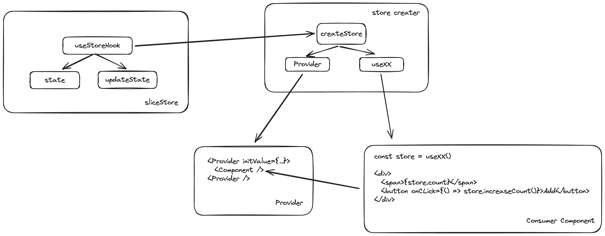

# {{ $frontmatter.summary }}

## 起因

在使用 `React` 时开发简单的项目时，想管理全局的 状态数据，但是又不想使用任何第三方库，内置的 `Context` 是个不错的方案。

使用方式如下：

```js
import { createContext, useContext, useState } from 'react'

const CounterContext = createContext(null)

function ClickButton() {
  const { count, increaseCount } = useContext(CounterContext)

  return (
    <div>
      <span>{count}</span>
      <button onClick={() => increaseCount()}>Increase Count</button>
    </div>
  )
}

function App() {
  const [value, setValue] = useState({
    count: 1,
    increaseCount() {
      setValue((pre) => ({
        ...pre,
        count: pre.count + 1
      }))
    }
  })

  return (
    <CounterContext.Provider value={value}>
      <ClickButton />
    </CounterContext.Provider>
  )
}

export default App
```

但是在定义和使用的时候，能否简化下呢？

- `Provider` 初始化后，只需调用 `useXX` 就返回 `Context` 的值，而无需再引入具体 `Context`
- 目前 `state` 和 `updateState` 的揉杂在一起，有没有更好的代码组织方式 ?

## 思路

为了梳理下思路，我们可以画个图，如下:



## 实现

核心代码如下：

`store/create-store.js`

```js
import { createContext, useContext } from 'react'

export function createStore(useHook) {
  const Context = createContext(null)

  function Provider(props) {
    const { children, initialState } = props

    const value = useHook(initialState)

    return <Context.Provider value={value}>{children}</Context.Provider>
  }

  function useStore() {
    return useContext(Context)
  }

  return {
    Provider,
    useStore
  }
}
```

以上就是全部代码了,只有 `16` 行代码实现, 让我们作为调用方试试

`store/counter.js`

```js
import { useCallback, useState } from 'react'
import { createStore } from './create-store'

function useHook(initialState = 0) {
  const [count, setCount] = useState(initialState)

  const increaseCount = useCallback(() => {
    setCount((pre) => pre + 1)
  }, [])

  return {
    count,
    increaseCount
  }
}

const counterStore = createStore(useHook)

export const CounterProvider = counterStore.Provider

export const useCounter = counterStore.useStore
```

`App.js`

```js
import { CounterProvider, useCounter } from './store/counter'

function ClickButton() {
  const { count, increaseCount } = useCounter()

  return (
    <div>
      <span>{count}</span>
      <button onClick={() => increaseCount()}>Increase Count</button>
    </div>
  )
}

function App() {
  return (
    <CounterProvider initialState={1}>
      <ClickButton />
    </CounterProvider>
  )
}

export default App
```

## 优缺点

对比 `redux`,`zustand` 这一类状态管理库，此种实现也是需要使用者去权衡利弊的。关于 `zustand` 和 `redux` 之间的区别，可以看这里 [zustand 与其它库的比较](https://docs.pmnd.rs/zustand/getting-started/comparison)。当前方案优缺点如下：

| 方案                  | 优点             | 缺点                                                    |
| --------------------- | ---------------- | ------------------------------------------------------- |
| Context 方案 / 本方案 | 易理解，使用简单 | 依赖 React,没有 `render` 优化,`Provider` 父组件全量渲染 |
